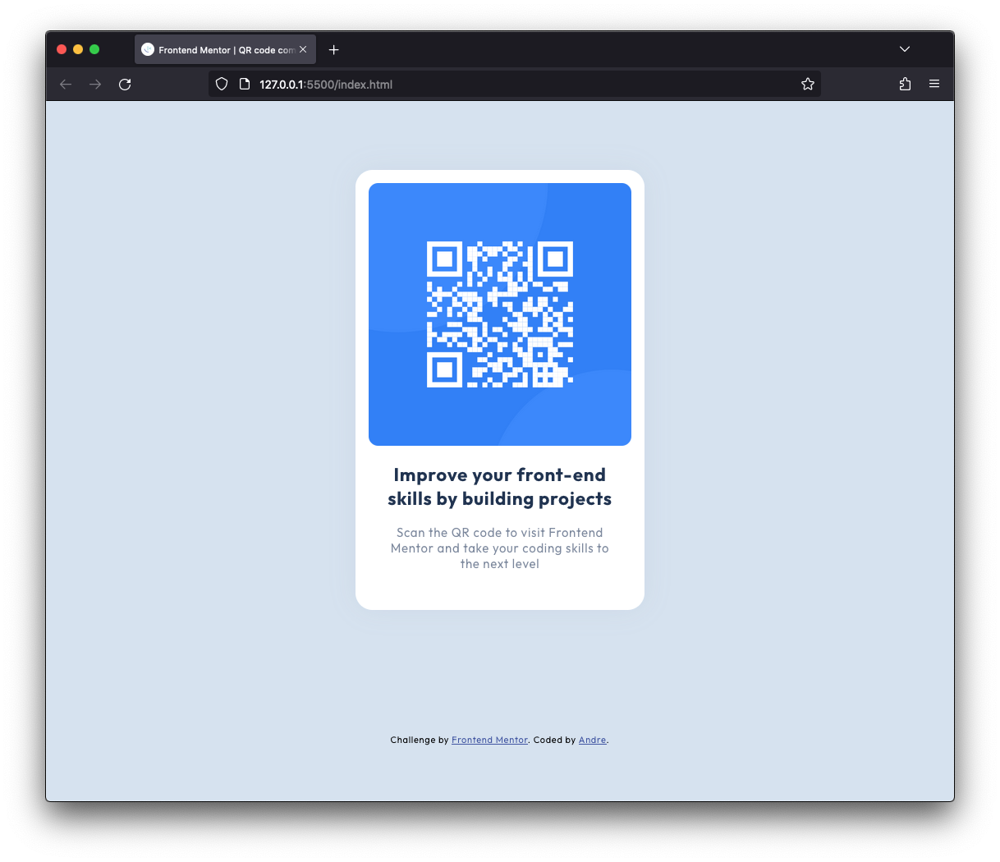

# Frontend Mentor - QR code component solution

This is a solution to the [QR code component challenge on Frontend Mentor](https://www.frontendmentor.io/challenges/qr-code-component-iux_sIO_H). Frontend Mentor challenges help you improve your coding skills by building realistic projects. 

## Table of contents

- [Overview](#overview)
  - [Screenshot](#screenshot)
  - [Links](#links)
- [My process](#my-process)
  - [Built with](#built-with)
  - [Continued development](#continued-development)
- [Author](#author)

## Overview

### Screenshot

### Links

- [Solution URL](https://github.com/ahzorek/FrontendMentor-QR_code_component)
- [Live Site URL](https://fastidious-chaja-bd6970.netlify.app)

## My process

### Built with

- Semantic HTML5 markup
- CSS custom properties
- CSS Grid
- Mobile-first workflow

### Continued development

This was a fun little project to get started with Frontend Mentor. Even being a very simple layout structure, coding it to get as close to the ref images as possible was interesting.

## Author

- Github - [Andre](https://github.com/ahzorek)
- Frontend Mentor - [@ahzorek](https://www.frontendmentor.io/profile/ahzorek)

